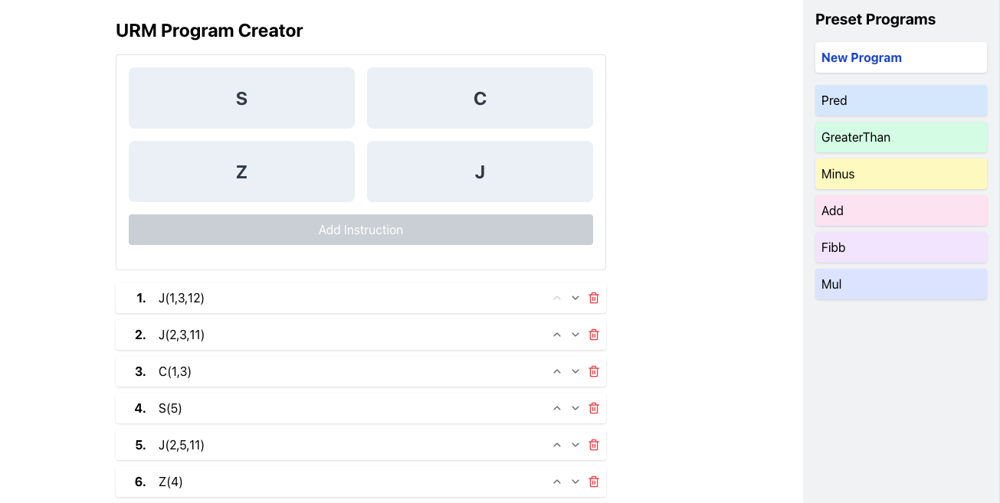

# URM 模拟器

URM 模拟器是一个 Python 库，用于模拟无限寄存器机（Unlimited Register Machine，URM）的操作。URM 是理论计算机科学中的一个简化模型，通过一系列基本操作来模拟计算过程。该库提供了定义 URM 程序、执行这些程序以及观察寄存器值变化的方法。

## 主要特性

- **支持四种基本 URM 操作**：零化、后继、复制和跳转。
- **程序执行和跟踪**：提供一个模拟器来执行 URM 程序并跟踪其执行过程。
- **自定义 URM 程序**：允许用户定义和执行自定义 URM 程序，并检查执行结果。
- **可视化支持**：增加 GUI 功能，支持可视化 URM 指令执行的每一步。这个功能将有助于用户学习和分析指令执行过程。

## 高级特性

- **size 函数**：计算 URM 程序中的指令数量。这对于分析程序复杂度和调试很有帮助。
- **haddr 函数**：找出 URM 程序中使用的最高寄存器地址。这对于确定程序需要多少寄存器至关重要。
- **normalize 方法**：规范化 URM 程序，确保所有跳转操作指向有效的指令行。这有助于优化程序结构并防止错误。
- **concat 方法**：将两个 URM 程序连接成一个单一程序。这对于构建复杂逻辑或重用现有代码很有用。
- **reloc 方法**：根据指定的映射重新定位 URM 程序中的寄存器地址。这在调整程序以适应特定寄存器配置时很有用。
## 安装
使用pip安装URM Simulator：
```bash
pip install urm
```

确保你的Python环境是3.7或更高版本。


## GUI 使用示例

您可以直接使用 GUI 功能，更方便直观地构建 URM 程序并可视化其执行过程。您只需在命令行执行以下指令：

```python
# 运行 GUI 程序
urm gui
```

程序将使用 8975 端口。如果有冲突，您可以自行修改端口号。

```python
# 修改端口
urm gui --port 8975
```

成功启动 GUI 程序后，您可以通过浏览器访问 http://localhost:8975/index 打开 URM 程序面板。




## Python 代码使用示例
以下是如何使用URM Simulator库来定义和执行一个简单URM程序的示例：
### add(x, y)函数
定义一个URM程序，使用URM模型计算两个数字的和。
```bash
import urm
from urm import C, J, Z, S

"""
Defines a URM program to calculate the sum of two numbers using the URM model.
The program uses the concept of Unlimited Register Machines for computation.

Parameters:
- input_R1: Contains the first number (x)
- input_R2: Contains the second number (y)
- output_R0: Will contain the result of adding x and y

The URM program consists of a series of instructions designed to add x and y.
"""

# Define the sequence of instructions for the addition operation.
add_instruct = urm.Instructions(
    C(2, 0),
    Z(2),
    J(1, 2, 0),
    S(0),
    S(2),
    J(3, 3, 3),
)

# Define the function to perform addition using the URM simulator.
def add(x, y, safety_count=1000):
    # Determine the number of registers needed based on the highest address used in instructions.
    num_of_registers = urm.haddr(add_instruct) + 1
    # Allocate the registers, initializing them to zero.
    registers = urm.allocate(num_of_registers)
    # Set up the initial values for the registers based on the inputs.
    input_nodes = {1: x, 2: y}
    # Execute the program and obtain the result.
    result = urm.forward(input_nodes, registers, add_instruct, safety_count=safety_count)
    # Return the value in the result register (R0).
    return result.last_registers[0]


if __name__ == '__main__':
    x = 5
    y = 7
    z = add(x, y)
    print(f'add({x}, {y}) = {z}')

```
**Output:**
```bash
add(5, 7) = 12
```
### predecessor(x)函数
定义一个URM程序来计算给定**自然数**的前驱。
```bash
import urm
from urm import C, J, Z, S

# Define a URM program to calculate the predecessor of a given number.
# The 'pred_instruct' represents a series of URM instructions for this purpose.
pred_instruct = urm.Instructions(
    J(0, 1, 0),
    S(2, ),
    J(1, 2, 0),
    S(0),
    S(2),
    J(0, 0, 3)
)


# Define the 'pred' function to calculate the predecessor of a number using the URM model.
def pred(x, safety_count=10000):
    # Determine the number of registers needed based on the highest address used in the instructions.
    num_of_registers = urm.haddr(pred_instruct) + 1
    # Allocate the registers, initializing them with zeros.
    registers = urm.allocate(num_of_registers)
    # Setup the initial values for the registers based on the input.
    input_nodes = {1: x}
    # Execute the URM program with the given instructions and input, then obtain the result.
    result = urm.forward(input_nodes, registers, pred_instruct, safety_count=safety_count)
    # Return the value in the result register (R0).
    return result.last_registers[0]


if __name__ == '__main__':
    for _ in range(5):
        x = random.randint(0, 10)
        y = pred(x)
        print(f'predecessor({x}) = {y}')
```
**Output:**
```bash
predecessor(9) = 8
predecessor(8) = 7
predecessor(4) = 3
predecessor(0) = 0
predecessor(3) = 2
```
### subtraction(x,y)函数
定义减法操作的指令序列。
```bash
import random

import urm
from urm import C, J, Z, S

# Define the sequence of instructions for the subtraction operation.
sub_instruct = urm.Instructions(
    C(1, 4),
    J(3, 2, 14),
    J(5, 4, 10),
    S(5),
    J(5, 4, 9),
    S(5),
    S(0),
    J(0, 0, 5),
    Z(5),
    S(3),
    C(0, 4),
    Z(0),
    J(0, 0, 2),
    C(4, 0),
)


# Define the 'sub' function to perform subtraction using the URM simulator.
def sub(x, y, safety_count=100000):
    # Determine the number of registers needed based on the highest address used in the instructions.
    num_of_registers = urm.haddr(sub_instruct) + 1
    # Allocate the registers, initializing them with zeros.
    registers = urm.allocate(num_of_registers)
    # Setup the initial values for the registers based on the inputs.
    input_nodes = {1: x, 2: y}
    # Execute the URM program with the given instructions and input, then obtain the result.
    result = urm.forward(input_nodes, registers, sub_instruct, safety_count=safety_count)
    # Return the value in the result register (R0).
    return result.last_registers[0]


# Main execution block to test the subtraction function.
if __name__ == '__main__':
    for _ in range(5):
        x, y = random.randint(0, 20), random.randint(0, 20)
        z = sub(x, y)
        print(f'subtraction({x}, {y}) = {z}')

```
**Output:**
```bash
subtraction(5, 14) = 0
subtraction(6, 9) = 0
subtraction(19, 13) = 6
subtraction(14, 1) = 13
subtraction(10, 3) = 7
```
### greater_than(x,y)函数
定义一个URM程序来确定x是否大于y，如果x>y则R0输出1，否则输出0。
```bash
import random

import urm
from urm import C, J, Z, S

# Defines a URM program to determine if x is greater than y.
gt_instruct = urm.Instructions(
    Z(0),

    # Check if either x (R1) or y (R2) is 0 first. If so, proceed to the "end game" conditions.
    J(1, 0, 25),
    J(2, 0, 24),

    # Compute the predecessor of R1 (x), simulating x - 1.
    Z(3),
    J(3, 1, 25),
    S(4),
    J(1, 4, 11),
    S(3),
    S(4),
    J(0, 0, 7),
    C(3, 1),
    Z(4),

    # Compute the predecessor of R2 (y), simulating y - 1.
    Z(3),
    J(3, 2, 25),
    S(4),
    J(2, 4, 20),
    S(3),
    S(4),
    J(0, 0, 16),
    C(3, 2),
    Z(4),

    Z(3),  # Reset R3 for safety.
    J(0, 0, 2),  # Jump back to the start to check conditions again.

    S(0),  # Set R0 to 1 indicating x > y.
)


# The gt function uses the URM model to determine if x > y.
def gt(x, y, safety_count=10000):
    # Determine the number of registers needed.
    num_of_registers = urm.haddr(gt_instruct) + 1
    # Allocate registers with initial values set to 0.
    registers = urm.allocate(num_of_registers)
    # Set initial values for x and y.
    input_nodes = {1: x, 2: y}
    # Execute the URM instructions and return the result stored in R0.
    result = urm.forward(input_nodes, registers, gt_instruct, safety_count=safety_count)
    return result.last_registers[0]


if __name__ == '__main__':
    for _ in range(5):
        x, y = random.randint(0, 20), random.randint(0, 20)
        z = gt(x, y)
        print(f'{x} > {y} is {z}')

```
**Output:**
```bash
10 > 4 is 1
20 > 19 is 1
20 > 1 is 1
14 > 20 is 0
18 > 19 is 0
```
### fibb(x)函数
定义使用URM模型计算第n个斐波那契数的指令。
```bash
import urm
from urm import C, J, Z, S

# Define the instructions for computing the nth Fibonacci number using the URM model.
fibb_instructions = urm.Instructions(
    J(1, 0, 0),  # If R1 (input n) is 0, end the program (fib(0) = 0, already in R0).
    S(0),  # Set R0 to 1 (to handle the case of fib(1)).
    J(1, 0, 0),  # If R1 is 1, end the program (fib(1) = 1).
    S(2),  # Initialize R2 (counter k) to 1.

    J(1, 2, 0),  # Loop condition: if R1 equals R2, end the program.

    S(2),  # Increment R2 (k).
    C(0, 4),  # Copy R0 (current Fibonacci number) to R4.
    Z(0),  # Zero R0 for the next calculation.
    Z(5),  # Zero R5, used as a counter in the loop.

    C(4, 0),  # Copy R4 (fib(k-1)) back to R0.
    J(5, 3, 15),  # Loop: if R5 equals R3, jump to instruction 15.
    S(0),  # Increment R0.
    S(5),  # Increment R5.
    J(1, 1, 11),  # Jump back to instruction 11, continue the loop.
    C(4, 3),  # Copy fib(k-1) to fib(k-2) for the next iteration.

    J(2, 2, 5),  # Jump back to instruction 5, continue until R1 equals R2.
)


# Define the function to compute the nth Fibonacci number using the URM instructions.
def fibb(x, safety_count=10000):
    # Determine the number of registers based on the highest address used.
    num_of_registers = urm.haddr(fibb_instructions) + 1
    # Allocate registers with initial values set to 0.
    registers = urm.allocate(num_of_registers)
    # Set the input value (n) in R1.
    input_nodes = {1: x}
    # Execute the URM program and return the result stored in R0 (the nth Fibonacci number).
    result = urm.forward(input_nodes, registers, fibb_instructions, safety_count=safety_count)
    return result.last_registers[0]


if __name__ == '__main__':
    for n in range(11):
        y = fibb(n)
        print(f'fibb({n}) = {y}')

```
### 跟踪其执行过程-predecessor(x)
如果你想跟踪你设计的URM程序的每一步执行过程中的指令和寄存器状态，可以参考以下**predecessor(x)**案例，它会显示每一步的过程来帮助你调试你的指令。
```bash
import random

import urm
from urm import C, J, Z, S

# Define a URM program to calculate the predecessor of a given number.
# The 'pred_instruct' represents a series of URM instructions for this purpose.
pred_instruct = urm.Instructions(
    J(0, 1, 0),
    S(2, ),
    J(1, 2, 0),
    S(0),
    S(2),
    J(0, 0, 3)
)


def pred(x, safety_count=10000):
    num_of_registers = urm.haddr(pred_instruct) + 1
    registers = urm.allocate(num_of_registers)
    input_nodes = {1: x}
    result = urm.forward(input_nodes, registers, pred_instruct, safety_count=safety_count)

    # Extract detailed execution information from the result.
    num_steps = result.num_of_steps  # The total number of steps (operations) performed.
    registers_from_steps = result.registers_from_steps  # The state of the registers after each step.
    ops_from_steps = result.ops_from_steps  # The description of each operation performed.

    # Iterate through each step of the computation.
    for idx in range(num_steps):
        # Print the operation performed in the current step.
        print(f'>{ops_from_steps[idx]}')
        # Print a summary of the register states after the current operation.
        print(registers_from_steps[idx].summary())

    return result.last_registers[0]


if __name__ == '__main__':
    x = 5
    y = pred(x)
    print(f'predecessor({x}) = {y}')

```
**Output:**
```bash
>Initial
R0      R1      R2
-----------------------
0       5       0
>1: J(0, 1, 0)
R0      R1      R2
-----------------------
0       5       0
>2: S(2)
R0      R1      R2
-----------------------
0       5       1
>3: J(1, 2, 0)
R0      R1      R2
-----------------------
0       5       1
>4: S(0)
R0      R1      R2
-----------------------
1       5       1
>5: S(2)
R0      R1      R2
-----------------------
1       5       2
>2: J(0, 0, 3)
R0      R1      R2
-----------------------
1       5       2
>3: J(1, 2, 0)
R0      R1      R2
-----------------------
1       5       2
>4: S(0)
R0      R1      R2
-----------------------
2       5       2
>5: S(2)
R0      R1      R2
-----------------------
2       5       3
>2: J(0, 0, 3)
R0      R1      R2
-----------------------
2       5       3
>3: J(1, 2, 0)
R0      R1      R2
-----------------------
2       5       3
>4: S(0)
R0      R1      R2
-----------------------
3       5       3
>5: S(2)
R0      R1      R2
-----------------------
3       5       4
>2: J(0, 0, 3)
R0      R1      R2
-----------------------
3       5       4
>3: J(1, 2, 0)
R0      R1      R2
-----------------------
3       5       4
>4: S(0)
R0      R1      R2
-----------------------
4       5       4
>5: S(2)
R0      R1      R2
-----------------------
4       5       5
>2: J(0, 0, 3)
R0      R1      R2
-----------------------
4       5       5


predecessor(5) = 4
```
## Author

- Jingyu Yan ([tunmxy@163.com](mailto:tunmxy@163.com))

